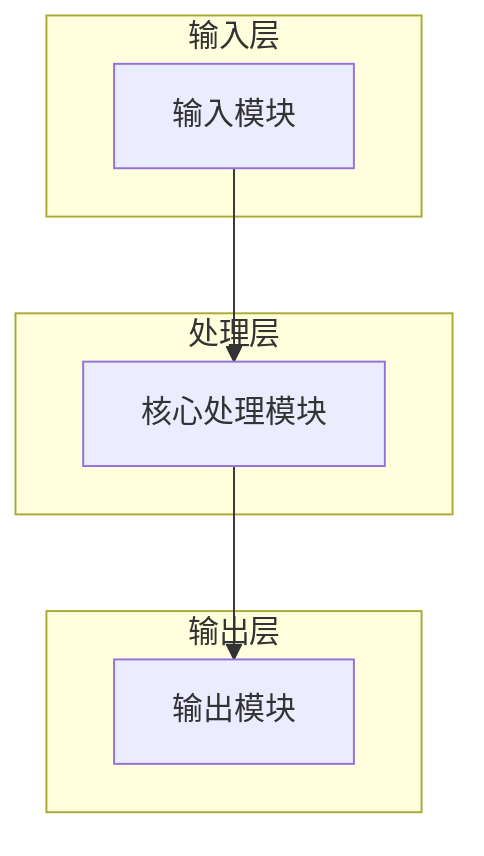
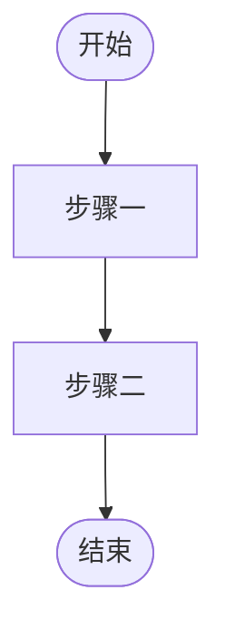

# 技术交底书

**案件名称**：[待填写]一种XXX方法及系统

**技术联系人**：
- 姓名：[待填写]
- 电话：[待填写]
- 邮箱：[待填写]

**专利类型**：发明

---

## 注意事项

（1）交底书应使代理人能看懂，尤其是背景技术和详细技术方案，一定要写得全面、清楚、完整；
（2）技术的公开程度，应以本领域普通技术人员不需付出创造性劳动即可进行实施为准。
（3）在与代理人沟通时，对于代理人咨询的技术问题，应给予回答并认真讲解，并且按要求及时正确地补充相应技术材料。

---

## 一、介绍相关技术背景，描述与本发明技术最相近的现有技术，并说明该现有技术存在的缺点

### 1.1 现有技术

（按技术方向分类；每条须含：标识/公开号、方案要点、应用场景、局限性、**可核验公开源 URL**）

#### 1.1.1 [技术方向 A]

（现有技术描述）

#### 1.1.2 [技术方向 B]

（现有技术描述）

### 1.2 现有技术存在的缺点

（逐项对应后文拟解决的技术问题）

---

## 二、针对上述缺点，说明本发明所要解决的技术问题

（明确、可检验的技术问题，与 1.2 一一对应）

---

## 三、本发明技术方案的详细阐述

### 3.1 背景

（应用场景、输入输出、约束条件）

### 3.2 系统框图

（建议使用 mermaid flowchart；定稿前可渲染为 PNG 嵌入 Word）

### 3.3 模块功能说明

（各模块作用及关联，非简单输入输出罗列）

### 3.4 系统流程说明

（建议使用 mermaid 流程图）

### 3.4.1 符号与公式

（若涉及公式：先定义符号与变量，再给出公式，再解释含义）

| 符号 | 含义 |
|------|------|
|      |      |

### 3.5 关键技术参数

| 参数名 | 符号 | 取值范围/典型值 | 说明 |
|--------|------|-----------------|------|
|        |      |                 |      |

---

## 四、与现有技术相比，本发明具有哪些优点？

（回扣 1.2 缺点与第二章技术问题；说明因果链）

---

## 五、本发明的技术关键点和欲保护点是什么？

（从核心方案抽象；可区分方法/系统/装置等保护客体）

---

## 六、其它

### 6.1 实施例

（可实施的具体例子，含关键参数与步骤）

### 6.2 技术效果

（可验证的效果描述，避免空泛形容词）

### 6.3 相关申请情况

（无则写「无」）
